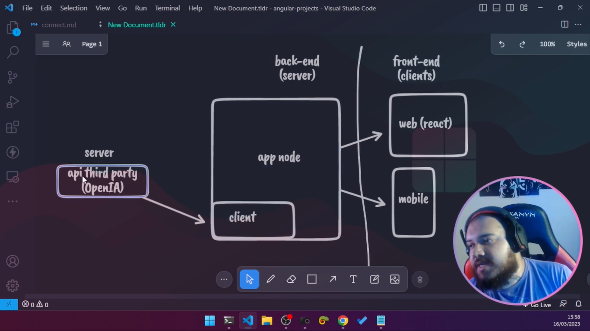

Integrando o ChatGPT com Node e React

--
INFORMAÇÕES

    DESCRIÇÃO < Full-Stack | Intermediário >

    Crie uma aplicação completa utilizando o recurso oficial da OpenAI, a inteligência por trás do chatGPT e crie um front-end clone da ferramenta mais popular do mercado para integrar com um back-end funcional.

    #Node.js #ChatGPT #Engenharia de Prompt #ReactIA #Generativa

    Proposto por: Felipe Aguiar - Tech Educator, DIO

        - https://www.linkedin.com/in/felipe-me/
        - https://github.com/felipeAguiarCode

--

CONTEÚDOS

- Introdução a solução integrada

- Explicando a Arquitetura

 
- Criando o server

    criação de diretório
    nota:  
    > npm init -y

    > code <endereço>

- Pré requisitos

    > node -v 

    
     https://platform.openai.com/usage

- Instalando dependências do projeto

    > npm i cors dontenv express openai

- Criando nosso servidor
   
- Configurações do ChatGpt
    
- Criando a controller
- Configurando as rotas da sua aplicação
- Bora criar o nosso frontend
- Criando um projeto React
- Estruturando seu projeto
- Estrutura de codificação
- Consumindo nossa API
- CSS padronizado
- Limpando o App js
- Aside menu
-  Criando a base do CSS do APP
- Criando componente de mensagem
- Usando o SVG Real do ChatGPT
- Definindo os hooks dos estados que vamos utilizar
- Implementando o log de chat

   Trabalhando com formulário e prevenção de eventos
    Estilizando a app principal
    Node Watch
    Dica de Dev tools e rodando aplicação
    Como destacar meu projeto e criar algo totalmente original
    Entendendo o Desafio